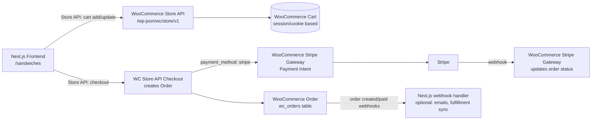

# Using WooCommerce as the Ordering Engine (Cart / Orders / Order Processing) with Stripe Payments

Status: **Planning document only — no code changes made.**
Scope: `/sandwiches` ordering flow (menu browsing, sandwich builder, modifiers, cart, checkout).

## 1. Current State (as of this scan)

WooCommerce today is used **only as a read-only product/category catalog**. All cart, pricing, and order logic is custom, and orders are never actually created anywhere except as a Stripe Checkout Session.

| Concern | Current implementation |
|---|---|
| Product/category data | WooCommerce REST API v3 (`wc/v3`) via `@woocommerce/woocommerce-rest-api`, consumer key/secret auth ([src/lib/woocommerce.ts](../src/lib/woocommerce.ts)) |
| Cart state | In-memory React state only (`CartContext`), lost on refresh, no persistence |
| Pricing | Duplicated logic: client-side (`src/utils/cartPricing.ts`, `src/pricing/priceCalculations.tsx`) and again server-side (`checkoutValidationService.ts`) |
| Tax | Hardcoded 8.1% flat rate in `taxService.ts`, ignoring WooCommerce tax settings/nexus rules |
| Checkout | Custom `/api/checkout/validate` + `/api/checkout/create-session` builds a **Stripe Checkout Session** directly with ad-hoc `price_data` line items |
| Orders | **No order is ever created in WooCommerce.** A successful payment only exists as a Stripe Checkout Session/PaymentIntent. There is no order record, no order number, no customer record, no email confirmation from WooCommerce, no admin visibility in WP admin. |
| Customer info | Form fields exist in `CheckoutCustomerForm.tsx` but are **not wired to anything** — not sent to Stripe, not sent to WooCommerce |
| Shipping/pickup | Not modeled at all |
| Coupons/discounts | Not supported |
| Inventory/stock | Not checked |
| Webhooks | None — no Stripe webhook handler exists, so nothing happens after payment succeeds besides redirecting to a success page |

This means today, if a customer pays, there is genuinely no durable "order" anywhere except in the Stripe dashboard. Refunds, reprints, kitchen/fulfillment views, receipts, order history, inventory decrement, etc. all have to be built by hand — which is exactly the pain WooCommerce is meant to remove.

## 2. Target Architecture

**Goal:** WooCommerce becomes the single source of truth for products, cart, pricing/tax, and orders. Stripe remains the payment processor only, plugged into WooCommerce's own checkout/payment pipeline rather than a bespoke Stripe Checkout Session.

Key shift: **the cart itself lives in WooCommerce** (via the Store API), not in React state, and **checkout creates a real WooCommerce Order**, with Stripe processing the payment through the order's payment gateway rather than a disconnected Stripe Checkout Session.

### 2.1 No redirect to a WooCommerce/WordPress-hosted page

The Store API (`/wp-json/wc/store/v1/*`) is a headless JSON API — it is not tied to rendering the WooCommerce Checkout block on the WordPress site. `/sandwiches/checkout` stays the customer-facing page for the entire flow, including payment:

1. Customer stays on `/sandwiches/checkout` the whole time (existing UI, no redirect to the WP domain).
2. A Next.js API route calls `POST /wc/store/v1/checkout` server-to-server, which creates the WooCommerce **Order** and (via WooCommerce Stripe Gateway's blocks integration) returns a Stripe **PaymentIntent client secret**.
3. The checkout page uses `@stripe/stripe-js` + Stripe Elements **embedded inline** to collect card details and confirm that PaymentIntent — Stripe's iframe renders inside the existing page, not a redirect to Stripe- or WooCommerce-hosted checkout.
4. On success, a finalize/confirm call updates order status, then the existing success UI renders — still on-site throughout.

Because checkout is proxied through Next.js API routes rather than the browser calling the Store API directly, CORS on the WordPress side is not required for this flow (server-to-server calls aren't subject to browser CORS). Browser-direct Store API calls are not recommended anyway, since it keeps WooCommerce cart tokens/nonces off the client.

## 3. Two Viable Integration Approaches

### Option A — WooCommerce Store API (Recommended)

WordPress/WooCommerce ship a first-party, no-plugin-required **Store API** (`/wp-json/wc/store/v1`) built for headless/JS front ends. It supports:

- `POST /wc/store/v1/cart/add-item`, `/cart/update-item`, `/cart/remove-item`, `GET /cart`
- Cart totals computed server-side by WooCommerce (subtotal, tax per WC tax rules, shipping, fees, coupons)
- `POST /wc/store/v1/cart/apply-coupon`
- `POST /wc/store/v1/checkout` — creates the WooCommerce Order and (with the Stripe extension) returns a payment-intent-based response for confirming payment client-side
- Cart is tied to a `cart-token` header (JWT-like) so it survives across requests without server sessions — good fit for a stateless Next.js API route layer
- Extendable via `ExtendRestApi` on the WP side to attach custom metadata (e.g., sandwich ingredient selections) to line items

**What line items look like:** each WooCommerce cart/order line item is tied to a real `product_id` (+ optional `variation_id`), with `quantity`, and a `cart_item_data` / `meta_data` bag for arbitrary custom data. This is exactly the extension point needed for "Choose Meat / Choose Cheese / Modifiers" style customization — instead of computing an ad hoc `additionalPrice`, each selected ingredient/modifier becomes either:
  - a **separate WooCommerce line item** referencing its own ingredient product (cleanest, gives WooCommerce accurate per-item tax/reporting), or
  - **item-level metadata** on the sandwich line item with a server-side price adjustment filter (`woocommerce_before_calculate_totals`) that adds the modifier prices to that one line item.

Given the existing data model (ingredients/modifiers are already WooCommerce products with their own price), **Option A's first approach (separate line items per ingredient, linked via meta_data referencing the "parent" line item) maps closest to zero custom pricing code** — WooCommerce computes totals, tax, and reporting per real product natively.

**Price-override modifiers** (e.g. "Half Sandwich & Soup", which replaces the sandwich's price with a flat $11.99 regardless of which sandwich was chosen) map the same way: the modifier's own product (already a distinct WooCommerce product, e.g. id `120`) becomes the priced line item instead of the base sandwich product. The originally-chosen sandwich is recorded as line item meta only (zero price impact) — see §4 item 6a for how this is also surfaced with a customer/staff-friendly display name and a $0 companion line item in WooCommerce-rendered views (admin, emails). Because Store API's `add-item` never accepts a client-supplied price, this mapping is inherently tamper-proof — no custom server-side price recomputation/validation service is needed for anything modeled as a real product line item; **`checkoutValidationService.ts` and `taxService.ts` are retired**, replaced by a much lighter selection-rule validator (e.g. "only one price-override modifier may be selected", required soup-flavor selection) that runs before calling `add-item`/`checkout`, not a pricing engine.

**Payments:** Use **WooCommerce Stripe Gateway** (official `woocommerce-gateway-stripe` plugin) or **WooCommerce Payments**. The Store API checkout endpoint integrates with these gateways to return the client secret needed to confirm a Stripe PaymentIntent from the frontend using `@stripe/stripe-js` + Stripe Elements, embedded directly in the Next.js checkout page (not a Stripe-hosted redirect page). This keeps the UI on-site the whole time.

### Option B — CoCart (third-party plugin)

CoCart is a popular community plugin that wraps WooCommerce cart/checkout in a more headless-friendly REST API, with better session handling, built-in CORS support, and a "CoCart Pro" checkout endpoint. It's a superset of what Store API does, at the cost of an extra paid plugin dependency and less "official" long-term support.

**Recommendation:** Start with the official **Store API** (Option A). It's actively developed by WooCommerce core, requires no extra plugin cost, and already supports everything needed (cart, coupons, checkout, extensibility). Only fall back to CoCart if Store API's extensibility proves insufficient for the sandwich customization model.

## 4. Required WordPress/WooCommerce-Side Changes

1. **Install/enable WooCommerce Stripe Gateway** (`woocommerce-gateway-stripe`) and configure it with the Stripe secret/publishable keys (same Stripe account currently used). This replaces the app's own `stripe` Node SDK usage for creating sessions — WooCommerce + the gateway plugin owns PaymentIntent creation, capture, and webhook-driven status transitions.
2. **Enable/confirm Store API is active** (bundled with WooCommerce since 8.x+; verify version installed on the WP site).
3. **Enable CORS on `/wp-json/wc/store/v1/*`** for the Next.js site's origin(s) (dev + prod), since requests originate browser-side from a different domain than the WordPress install.
4. **Decide and configure tax settings in WooCommerce** (tax classes/rates by zip/zone) to replace the hardcoded 8.1% — this is one of the biggest wins of the migration.
5. **Configure shipping/pickup**: Since this is a restaurant/local-pickup style store, set up a WooCommerce "Local Pickup" shipping method (or a custom order-type field) so checkout has a place to attach fulfillment method (pickup time/location) — needs product/business input on what pickup flow should look like (single location vs. multiple).
6. **Register a custom REST field / meta on cart items & order line items** (via a small must-use plugin or theme functions file) so custom sandwich data (selected ingredients not modeled as separate line items, if any; builder step selections; special instructions) can round-trip through `cart_item_data` → order `meta_data` and show up correctly in WP Admin → Orders and any kitchen-facing view.
6a. **Line item display-name override for price-override modifiers** (e.g. "Half Sandwich & Soup"): add a `woocommerce_checkout_create_order_line_item` hook that reads the base sandwich name out of the line item's meta and calls `set_name()` on the order line item, so admin/order-email/kitchen-ticket views show the sandwich name (e.g. "Turkey Club") instead of the modifier product's own name. Pair this with the free ($0.00) companion product (e.g. "1/2 Sandwich & Soup", product `165`) added as its own line item so the order still visibly reflects the modifier chosen. The existing headless-cart mu-plugin allows zero-priced products in the informational modifier categories `order-modifier`, `select-chips`, and `select-side` through `woocommerce_is_purchasable`; they remain zero-priced and do not participate in inventory or revenue. This uses the same custom meta_data channel as item 6 above — no separate plugin needed. Only affects WooCommerce-rendered surfaces; the headless Next.js UI already controls its own display names via meta_data regardless.
7. **Webhook endpoint for Stripe → WooCommerce**: the Stripe Gateway plugin registers its own webhook receiver on the WP side (e.g. `https://<wp-site>/?wc-api=wc_stripe`). Just needs to be added in the Stripe Dashboard webhook config — no Next.js code needed for this part.
8. **Guest checkout allowed** (WooCommerce setting) since sandwich customers likely won't have accounts, unless the plan is to also introduce customer accounts/order history on the Next.js site.

## 5. Required Next.js-Side Changes

### 5.1 New "WooCommerce Store API" client
Add a `src/lib/wooCommerceStoreApi.ts` (parallel to the existing REST v3 `woocommerce.ts`) that:
- Talks to `/wp-json/wc/store/v1/*` using `fetch`
- Persists the `Cart-Token` response header (WooCommerce's stateless cart token) — likely stored in an httpOnly cookie set by a Next.js API route proxy, since Store API tokens should not be freely readable/writable from arbitrary client JS in a security-sensitive way
- Forwards `Nonce`/`Cart-Token` headers on every subsequent request

### 5.2 Cart state: replace `CartContext` internals
`CartContext` (public API: `addItem`, `removeItem`, `updateQuantity`, `updateItem`, `clearCart`) can largely keep its **hook shape** so components using it don't need a rewrite, but its implementation moves from local `useState` to:
- Calling Next.js API routes that proxy to WooCommerce Store API (`/api/cart/add`, `/api/cart/update`, `/api/cart/remove`), which return the authoritative WooCommerce-computed cart (with real subtotal/tax/total) — no more client-side price math for anything that's a real WooCommerce line item
- Cart state in React becomes a thin cache of the last server response, hydrated on mount from the Store API `GET /cart` using the stored cart token, so refresh no longer wipes the cart (this also fixes the "cart lost on refresh" bug for free)

### 5.3 Sandwich builder / modifiers → line item mapping
This is the highest-effort/highest-risk part of the migration and needs its own design pass:
- Decide the final mapping of "custom sandwich + ingredients + modifiers" to WooCommerce line items (separate line items with `meta_data.parent_line_item_key`, vs. one line item with rich `meta_data` and a server-side price filter).
- Update `customSandwichToCartItem` / `cartItemFactory.ts` / `ingredientFactory.ts` / `modifierDraftFactory.ts` to build **Store API `add-item` payloads** instead of internal `CartItem` objects.
- The chosen ingredient/modifier products already exist as WooCommerce products (per current architecture), so the "quantity 1, product_id = ingredient's WC id, cart_item_data = {parent_key, group_name}" shape is the natural fit.

### 5.4 Remove custom pricing/tax logic
- Delete or drastically shrink `src/services/checkout/checkoutValidationService.ts` and `src/services/checkout/taxService.ts` — WooCommerce computes subtotal, tax (per configured tax rates), and total server-side on every cart mutation; the client just displays the numbers Store API returns.
- `src/utils/cartPricing.ts` and `src/pricing/priceCalculations.tsx` become **display/estimate helpers only** (e.g., optimistic UI before a request round-trips), not sources of truth.

### 5.5 Checkout flow rewrite
- Replace `/api/checkout/validate` and `/api/checkout/create-session` with a single `/api/checkout` route (or direct client call, if CORS/security allow) that calls **Store API `POST /wc/store/v1/checkout`** with billing details, shipping/pickup selection, and payment method data.
- Wire up `CheckoutCustomerForm.tsx` fields (name/email/phone/notes) to actually populate the Store API checkout's `billing_address` (and `customer_note`) instead of being decorative.
- Add a pickup-method / fulfillment-time selection UI, mapped to whatever shipping method/order meta is configured on the WP side (Section 4.5).
- Swap the current **Stripe-hosted Checkout Session redirect** for an **embedded Stripe Elements payment form** on the Next.js checkout page: use `@stripe/stripe-js` (new frontend dependency — not currently installed) to collect card details and confirm the PaymentIntent whose client secret comes back from the Store API checkout response (per WooCommerce Stripe Gateway's blocks/Store API integration contract).
- Success/failure now driven by the WooCommerce order status transition, not a Stripe Checkout Session id; success page should look up the WooCommerce order (via the returned order id/key) to show a real order confirmation/order number.

### 5.6 New API surface (Next.js `src/app/api/`)
| Route | Purpose |
|---|---|
| `/api/cart` (GET) | Proxy Store API `GET /cart`, return current cart + totals |
| `/api/cart/add` (POST) | Proxy `POST /cart/add-item` |
| `/api/cart/update` (POST) | Proxy `POST /cart/update-item` |
| `/api/cart/remove` (POST) | Proxy `POST /cart/remove-item` |
| `/api/cart/coupon` (POST) | Proxy `POST /cart/apply-coupon` (new capability) |
| `/api/checkout` (POST) | Proxy `POST /checkout`, return order id + Stripe PaymentIntent client secret |
| `/api/checkout/confirm` (POST, optional) | If needed, finalize/poll order status after Stripe confirms payment client-side |

Existing `/api/checkout/validate` and `/api/checkout/create-session` are retired.

### 5.7 Types to add/change
- `src/types/checkout.ts` (currently empty) should hold `StoreApiCart`, `StoreApiCheckoutResponse`, `PickupDetails`, etc., mirroring the Store API JSON schema (WooCommerce publishes an OpenAPI-ish schema for Store API — pull field names from there rather than guessing).
- `src/types/cart.ts`'s `CartItem`/`CartModifier` either get replaced by Store API's own cart item shape, or kept as a thin UI-facing view model mapped from the Store API response (recommend the latter, to minimize churn in components like `CartItemCard`, `ModifierSection`, etc.).

### 5.8 New dependencies
- `@stripe/stripe-js` (frontend Stripe Elements)
- Possibly drop the direct `stripe` Node SDK usage for checkout-session creation (no longer needed once WooCommerce/Stripe Gateway owns PaymentIntent creation) — keep it only if still needed for something else (e.g., admin refunds via API, if not done through WP admin).

## 6. Migration Strategy / Phasing

Because this is a meaningful rearchitecture, recommend an incremental rollout rather than a big-bang rewrite:

1. **Phase 1 — WP side setup (no frontend changes):** Install/configure WooCommerce Stripe Gateway, enable Store API + CORS, configure tax classes and a pickup "shipping" method in WP admin. Verify with `curl`/Postman that Store API cart/checkout works end-to-end against real products, independent of the Next.js app.
2. **Phase 2 — Cart migration:** Introduce the Store API proxy routes and swap `CartContext`'s internals to call them, while keeping the current custom Stripe Checkout Session checkout temporarily (so cart behavior can be validated in isolation, including the ingredient/modifier line-item mapping).
3. **Phase 3 — Checkout migration:** Replace the checkout page's Stripe redirect with the embedded Stripe Elements + Store API checkout flow; wire up the customer form and pickup selection; retire the old validate/create-session routes and the custom tax/pricing services.
4. **Phase 4 — Cleanup & hardening:** Remove now-dead code (`checkoutValidationService.ts`, `taxService.ts`, client-side price calculators used as truth), add order-status polling/webhook-driven UI updates if needed, add automated tests around the new API proxy routes.

## 7. Open Questions / Decisions Needed Before Implementation

1. Pickup logistics: single location vs. multiple, and how "pickup time" should be modeled in WooCommerce (custom order meta vs. a plugin like WooCommerce Pickup Plus).
2. Whether guest checkout only, or also customer accounts/order history surfaced on the Next.js site.
3. Final line-item mapping strategy for ingredients/modifiers (separate line items vs. metadata + price-filter on one line item) — affects WP admin readability and kitchen-facing order display.
4. Whether the existing WooCommerce Stripe API keys already in use are compatible with WooCommerce Stripe Gateway's requirements (should be, since it's the same Stripe account either way).
5. Any requirement to keep supporting the old Stripe Checkout Session flow during a transition window (e.g., feature-flagged rollout).5. ~~Whether the browser talks to the Store API directly (requiring CORS) or only via Next.js server-side proxy routes~~ — resolved: proxy through Next.js API routes, checkout stays fully embedded on `/sandwiches/checkout`, no CORS or WP-hosted page needed (see §2.1).
## 8. Summary

The current implementation treats WooCommerce as a product catalog and Stripe as a completely separate, disconnected payment processor — no order is ever durably created. The recommended path is to adopt WooCommerce's **Store API** for cart and checkout (keeping Stripe as the payment method via the **WooCommerce Stripe Gateway** plugin, using embedded Stripe Elements instead of a hosted Checkout Session). This shifts cart persistence, pricing, tax calculation, and order lifecycle entirely into WooCommerce — eliminating the custom `checkoutValidationService`/`taxService` logic and giving the business real order records, admin visibility, refund tooling, and reporting "for free."
